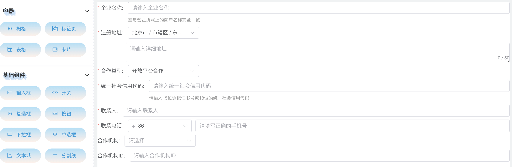
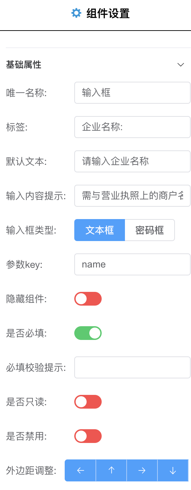
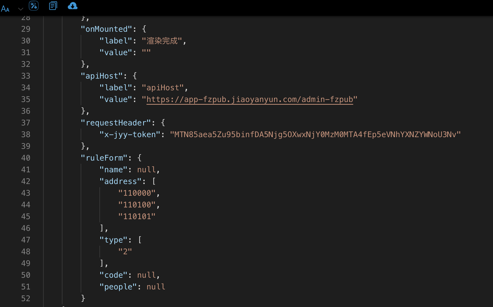

# 快速上手

## 九层之台，起于垒土
人生是一场旅程。我们经历了几次轮回，才换来这个旅程。而这个旅程很短，因此不妨大胆一些，不妨大胆一些去爱一个人，去攀一座山，去追一个梦……有很多事我都不明白。但我相信一件事。上天让我们来到这个世上，就是为了让我们创造奇迹。来，有缘人，这是去往 [追逐梦想之地](https://formcreator.jiaoyanyun.com/) 的链接，点开它，去创造属于自己的奇迹吧~

## 山重水复疑无路，柳暗花明又一村
::: tip 准备食材
从左侧的组件库中，拖拽出你需要的元素，摆放到中间的舞台上，你就可以得出你就可以得到没有灵魂的表单
:::

::: tip 开始烹饪
然后，通过右侧的元素配置，给你的表单注入灵魂的key，往往上好的食材，其实只需要最朴素的烹饪方式
:::

::: tip 最后出锅
最后，点击上边的导出按钮，你就可以得到一份新鲜出炉的JSON文件
:::
